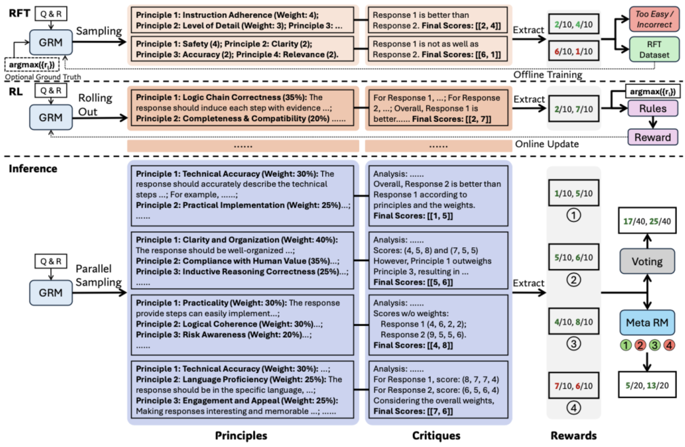

# RLHF

[大模型入门（六）—— RLHF微调大模型](https://www.cnblogs.com/jiangxinyang/p/17374278.html)

[DeepSpeedExamples](https://github.com/deepspeedai/DeepSpeedExamples)

[RLHF 微调三阶段解析 &amp; RLHF 的变体](https://zhuanlan.zhihu.com/p/646934197)

[详解大模型RLHF过程（配代码解读）](https://zhuanlan.zhihu.com/p/624589622)

[RLHF 技术分解](https://huggingface.co/blog/zh/rlhf)

[解析 RLHF 微调三阶段](https://www.53ai.com/news/qianyanjishu/1742.html)

[【强化学习的数学原理】课程：从零开始到透彻理解（完结）](https://www.bilibili.com/video/BV1sd4y167NS/?spm_id_from=333.788.videopod.episodes&vd_source=cd4121ae5573fd5dd16005c659b91084&p=2)

# GRPO

[详解DeepSeek-R1核心强化学习算法：GRPO](https://zhuanlan.zhihu.com/p/21046265072)

[DeepSeek关键RL算法GRPO，有人从头跑通了，贡献完整代码](https://www.jiqizhixin.com/articles/2025-03-02-3)

[The Hundred-Page Language Models Book](https://github.com/aburkov/theLMbook)

# 自原则批判微调SPCT[自原则批判微调DS](https://www.infoq.cn/article/4aWp47YEqtAJzJf9E5yb)

DeepSeek—GRM（逐点生成式奖励建模）

